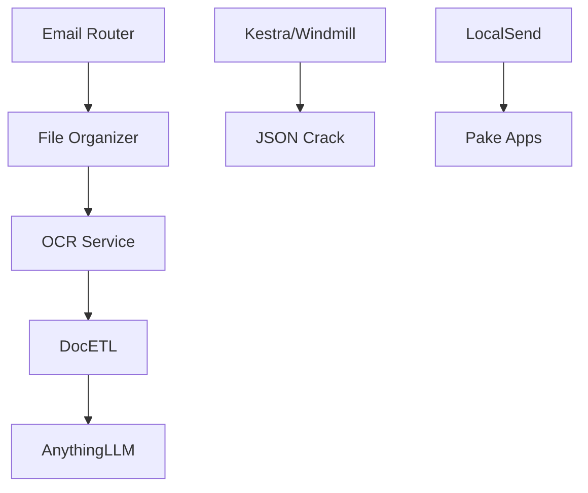

# SOGUM Intelligent Document Processing Platform

[](https://artifacthub.io/packages/search?repo=sogum)
[](https://opensource.org/licenses/Apache-2.0)

## Overview

The SOGUM Umbrella Chart deploys a comprehensive Intelligent Document Processing Platform on Kubernetes, featuring AI-powered document analysis, OCR capabilities, and workflow automation.

## Features

- 🤖 **AI/LLM Integration** - AnythingLLM for intelligent document analysis
- 📄 **OCR Processing** - Advanced Optical Character Recognition
- 🔄 **ETL Pipelines** - DocETL for data transformation
- 📁 **File Organization** - Automated document categorization
- ⚡ **Workflow Automation** - Kestra and Windmill integration
- 📊 **Data Visualization** - JSON Crack for data structure analysis
- 📤 **File Sharing** - LocalSend for secure file transfer
- 📧 **Email Routing** - Intelligent email processing

## Architecture



## Quick Start

### Prerequisites

- Kubernetes 1.19+
- Helm 3.8+
- StorageClass with ReadWriteMany support (for shared storage)

### Installation

```bash
# Add the SOGUM Helm repository
helm repo add sogum https://charts.sogum.ai
helm repo update

# Install the umbrella chart
helm install my-sogum sogum/sogum-umbrella \
  --namespace sogum-system \
  --create-namespace \
  --values values.yaml
```

### Configuration

Key configuration options:

| Parameter | Description | Default |
|-----------|-------------|---------|
| `global.environment` | Environment (dev/staging/prod) | `dev` |
| `global.storageClass` | Storage class for persistent volumes | `default` |
| `ocr_service.enabled` | Enable OCR service | `true` |
| `docetl.enabled` | Enable DocETL service | `true` |
| `anything_llm.enabled` | Enable AnythingLLM service | `true` |

## Services

### Core Services

- **OCR Service** (Port 8080) - Document text extraction
- **DocETL** (Port 5000) - Data transformation pipelines
- **File Organizer** (Port 4000) - Document categorization
- **AnythingLLM** (Port 3001) - AI document analysis

### Workflow Services

- **Kestra** (Port 8081) - Workflow orchestration
- **Windmill** (Port 8000) - Script automation
- **JSON Crack** (Port 8082) - Data visualization
- **LocalSend** (Port 53317) - File sharing

## Development

For development environments, use the dev values:

```bash
helm install sogum-dev . -f values-dev.yaml
```

## Production Deployment

For production deployments:

```bash
helm install sogum-prod . -f values-prod.yaml \
  --set global.environment=production \
  --set global.resources.limits.cpu=2 \
  --set global.resources.limits.memory=4Gi
```

## Monitoring and Observability

The platform includes built-in health checks and monitoring endpoints:

- Health checks available at `/health` for each service
- Prometheus metrics exposed on `/metrics`
- Grafana dashboards included

## Security

- All services run with non-root users
- Network policies restrict inter-service communication
- Secrets management for sensitive configuration
- RBAC controls for service accounts

## Troubleshooting

Common issues and solutions:

1. **Storage Issues**: Ensure your cluster has a storage class that supports ReadWriteMany
2. **Memory Limits**: AI services may require more memory in production
3. **Network Policies**: Check if network policies are blocking service communication

## Contributing

1. Fork the repository
2. Create a feature branch
3. Submit a pull request

## License

This chart is licensed under the Apache 2.0 License.

## Support

- Documentation: https://docs.sogum.ai
- Issues: https://github.com/your-org/sogum-platform/issues
- Community: https://discord.gg/sogum
